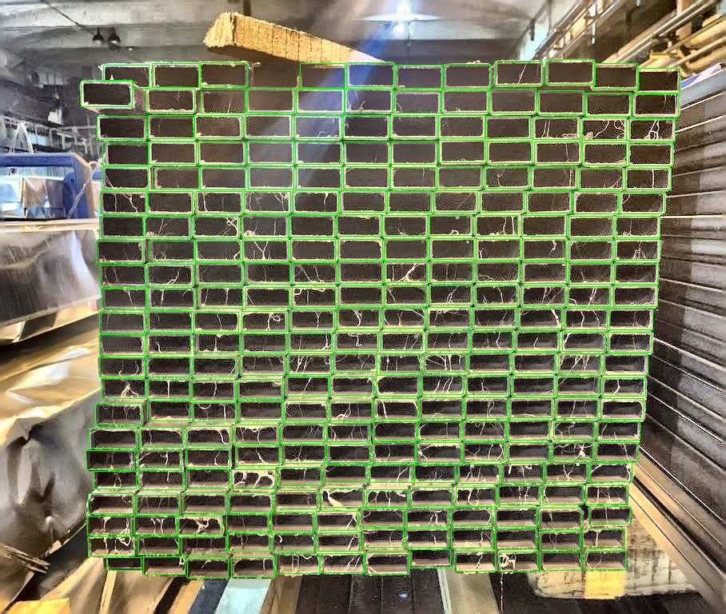
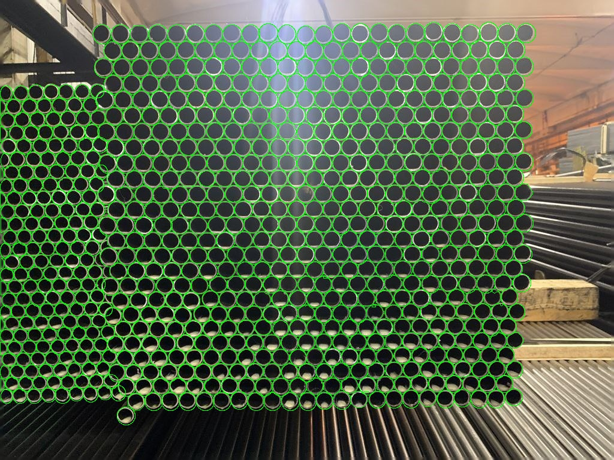

# Телеграмм бот на основе искусственного интеллекта для подсчёта труб на фотографии
## Описание проекта
Данный проект представляет собой телеграмм бота, использующего методы искусственного интеллекта для автоматического подсчёта труб на фотографиях. Бот способен распознавать два типа труб: круглые и квадратные/прямоугольные.
## Структура проекта

Проект состоит из двух основных папок:

1. *Artificial intelligence methods*:
- В этой папке находятся скрипты, отвечающие за подсчёт труб и улучшение качества фотографий. Подробности о работе каждого скрипта можно найти в файле README, который находится внутри этой папки.

2. *telegram interface*:
- Здесь расположен код для запуска телеграмм бота и дополнительные конструкции, необходимые для его функционирования.

## Установка

Все необходимые библиотеки можно найти в соответствующих папках, а также инструкции по установке в файлах README.

## Примеры работы

Ниже представлены примеры изображений, на которых бот успешно распознаёт трубы:

- Подсчёт прямоугольных труб:

- Подсчёт круглых труб:

## Технологии

- *Модель YOLOv8*: Используется для распознавания объектов на изображениях.
- *Сегментация*: Применяется для выделения контуров труб, что позволяет повысить точность подсчёта.

## Поддерживаемые категории труб

В проекте реализовано распознавание двух категорий труб:

- *Круглые*
- *Квадратные/Прямоугольные*

## Как использовать

1. Запустите телеграмм бота, следуя инструкциям в папке  telegram interface .
2. Выберете категорию трубы для распознавания.
3. Отправьте фотографию с трубами боту.

4. Получите результат подсчёта труб на изображении.

## Разработчикам на кофе☕️
## https://yoomoney.ru/fundraise/13DPASMJTO0.240617

## Разрабатывали:

### [@Sashakrem8320](https://github.com/Sashakrem8320)
### [@Fl1nixxx](https://github.com/Fl1nixxx)
### [@alickqs](https://github.com/alickqs)
### [@tmbochka](https://github.com/tmbochka)

